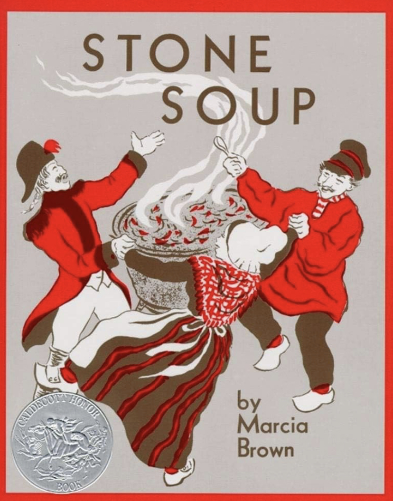

# The Church of Collective Providence

The Church of Collective Providence is a global collective of individuals united by a shared commitment to reciprocity, otherwise known as [The Golden Rule](https://en.wikipedia.org/wiki/Golden_Rule). Our mission is to cultivate collective providence for the benefit of all. Reciprocity is how we realize that mission.

## What is collective providence?

Collective providence is that which makes a collective greater than the sum of its parts. It is how a collective provides for its members more than the members could provide for themselves individually.

Unlike divine providence, which is by definition beyond human comprehension, collective providence is tangible and even measurable. Collective providence is something we can systematically study and cultivate.

## What is reciprocity?

Reciprocity means doing unto others as you would have them do unto you, and it is a common value found across many cultures and religious traditions. It is also a key enabling factor in the cultivation of collective providence. 

When members of a collective practice reciprocity, helping anyone helps everyone.

## Stone Soup

In the story of [Stone Soup](https://en.wikipedia.org/wiki/Stone_Soup), a group of hungry travelers arrive at a village and ask the villagers for food, but the villagers refuse. So the travelers set up a pot of boiling water with some stones in it and tell the villagers that they are making stone soup, which they will gladly share with the villagers, but they need some additional ingredients to make the soup taste better. The villagers agree to share their ingredients and everyone enjoys the soup. 

One of the key ingredients in collective providence is commitment. Getting individuals to commit to supporting the collective is often necessary for the collective to be able to support its members. But often individuals are hesitant to commit before they see evidence that the collective will reciprocate. The story of Stone Soup illustrates one way to solve this chicken-and-egg problem.

The stones allow the travelers to call it “soup” rather than just “hot water”. And once the villagers perceive that there is soup, that perception is enough to free the villagers of their hesitance, allowing them to commit to sharing ingredients.

The Church of Collective Providence is similar to Stone Soup. This church is just an idea. But by calling it a church it becomes joinable. Once people join, it becomes a true church just as stone soup becomes a true soup.
