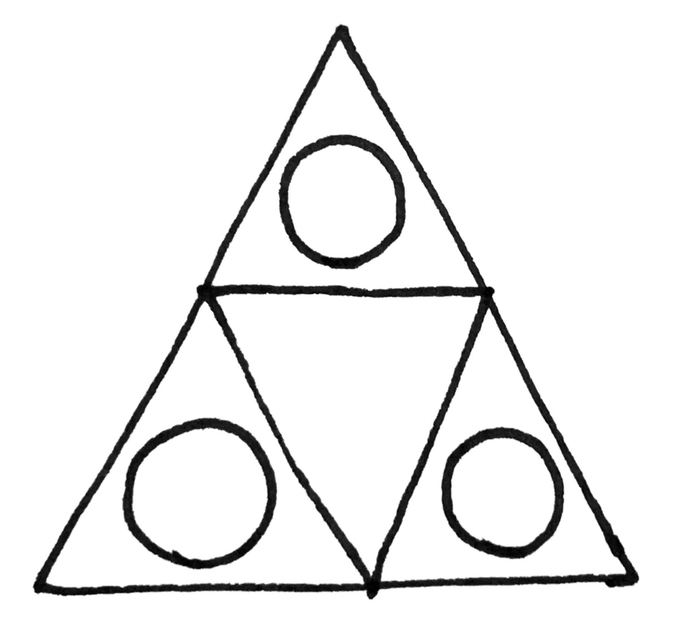

# The Church of Collective Providence

The Church of Collective Providence is a global collective of individuals united by a shared commitment to reciprocity, otherwise known as [The Golden Rule](https://en.wikipedia.org/wiki/Golden_Rule). Our mission is to cultivate collective providence for the benefit of all. Reciprocity is how we realize that mission.

## What is collective providence?

Collective providence is that which makes a collective greater than the sum of its parts. It is how a collective provides for its members more than the members could provide for themselves individually.

Unlike divine providence, which is by definition beyond human comprehension, collective providence is tangible and even measurable. Collective providence is something we can systematically study and cultivate.

## What is reciprocity?

Reciprocity means doing unto others as you would have them do unto you, and it is a common value found across many cultures and religious traditions. It is also a key enabling factor in the cultivation of collective providence. 

When members of a collective practice reciprocity, helping anyone helps everyone.

## Stone Soup

In the story of [Stone Soup](https://en.wikipedia.org/wiki/Stone_Soup), a group of hungry travelers arrive at a village and ask the villagers for food, but the villagers refuse. So the travelers set up a pot of boiling water with some stones in it and tell the villagers that they are making stone soup, which they will gladly share with the villagers, but they need some additional ingredients to make the soup taste better. The villagers agree to share their ingredients and everyone enjoys the soup. 

One of the key ingredients in collective providence is commitment. Getting individuals to commit to supporting the collective is often necessary for the collective to be able to support its members. But often individuals are hesitant to commit before they see evidence that the collective will reciprocate. The story of Stone Soup illustrates one way to solve this chicken-and-egg problem.

The stones allow the travelers to call it “soup” rather than just “hot water”. And once the villagers perceive that there is soup, that perception is enough to free the villagers of their hesitance, allowing them to commit to sharing ingredients.

The Church of Collective Providence is similar to Stone Soup. This church is just an idea. But by calling it a church it becomes joinable. Once people join, it becomes a true church just as stone soup becomes a true soup.

## Is this a religious group?

In one sense, yes. But it’s really more like a game. The goal of the game is to cultivate more and more collective providence through the practice of reciprocity. It’s up to you how much you want to frame the practice of reciprocity as a spiritual practice. Faith and devotion can provide you with a sense of purpose and meaning in life that is otherwise difficult to achieve. But there’s no requirement that you treat it as a spiritual thing if that’s not how you want to approach it.

Additionally, you may already have a religious faith or spiritual path. The practice of reciprocity is perfectly compatible with most religious faiths and spiritual practices. So you do not have to dedicate yourself exclusively to our church. You can be a member of other religious communities as well.

## How to join

Members of the Church of Collective Providence are united by one thing: our commitment to reciprocity. 

All that is required to become a member is to join a lineage (or start your own) by creating a commitment document as described below.

1. At the top of a physical piece of paper, draw the symbol of the Eyes of Providence as shown above (one large triangle made of three smaller triangles, each containing a circle/eye). This symbol represents collective providence.
2. Beneath the symbol, write down your heartfelt commitment to practicing reciprocity in your life to the best of your ability for the benefit of all.
3. Sign the document yourself and get two existing church members of your chosen lineage to co-sign the document as witnesses of your commitment. If there are no existing church members available to co-sign, you and two other people can start a new lineage and all join the church simultaneously by co-signing each other’s commitment documents in bootstrap fashion.

Once you have written down your commitment under the Eyes of Providence, along with your signature and the signatures of your two co-signers, you are now a member of the church.

## Lineages

One risk that comes with commitment to reciprocity is the risk of exploitation. If someone knows that you’ve made a commitment to treating others kindly, they might take advantage of your kindness without reciprocating.

Another risk is that of misaligned expectations about what reciprocity actually looks like in practice. When people agree to support each other, the implementation details matter. Good intentions don’t automatically translate to good outcomes.

Lineages are a way to build trust and clarify expectations. By requiring existing members of a lineage to sign the commitment documents of new members, a chain of trust and understanding is built over time through those relationships.

Different lineages can have different norms and customs, including requirements for joining that are additional to the basic requirement of commitment to reciprocity. Make sure you understand the expectations of your chosen lineage before joining.

