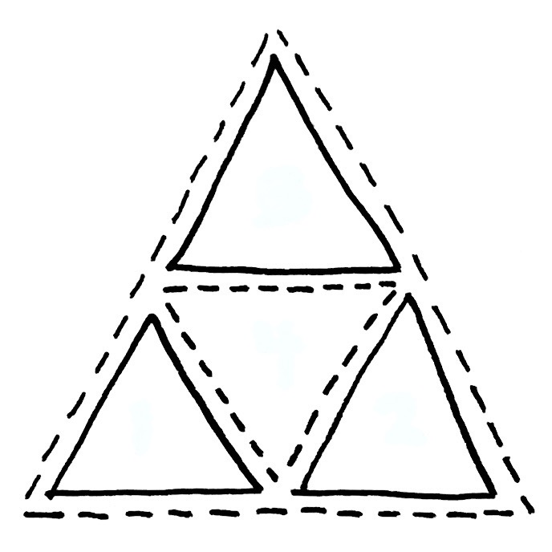
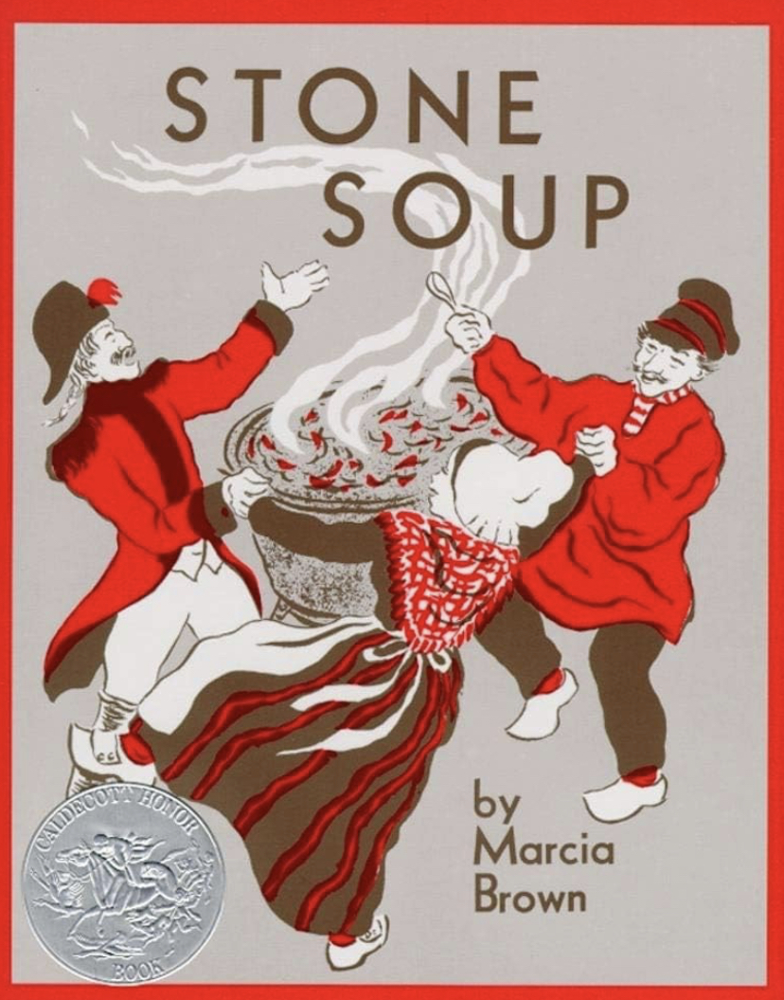

# The Church of Collective Providence

The Church of Collective Providence is a "fictional" institution and live action role playing game (larp). To play the game, first flip a coin. If it lands tails, know that the church is indeed a _fictional_ institution that you are only pretending is real as a bit. If it lands heads, know that the church is actually a _real_ institution that you are only pretending is a larp for the sake of the uninitiated.

If you find this confusing, you've got it! Confusion and uncertainty are necessary ingredients for collective providence to emerge (that's what we tell the newcomers, at least). If you need something a bit more concrete, you can think of it this way:

The Church of Collective Providence is an imaginary/real-enough institution established as a social convention for people who wish to join a collective that’s just religious enough to catalyze mutually supportive relationships in service of something greater than oneself, but not so religious that it undermines epistemic humility or individual self-sovereignty.

The only real rule of the game is reciprocity. [The Golden Rule](https://en.wikipedia.org/wiki/Golden_Rule). Treat others the way you want to be treated. Reciprocity is what makes collective providence possible.

## Stone Soup

In the story of [Stone Soup](https://en.wikipedia.org/wiki/Stone_Soup), a group of hungry travelers arrive at a village and ask the villagers for food, but the villagers refuse. So the travelers set up a pot of boiling water with some stones in it and tell the villagers that they are making stone soup, which they will gladly share with the villagers, but they need some additional ingredients to make the soup taste better. The villagers agree to share their ingredients and everyone enjoys the soup. 

One of the key ingredients in collective providence is commitment. Getting individuals to commit to supporting the collective is often necessary for the collective to be able to support its members. But often individuals are hesitant to commit before they see evidence that the collective will reciprocate. The story of Stone Soup illustrates one way to solve this chicken-and-egg problem.

The stones allow the travelers to call it “soup” rather than just “hot water”. And once the villagers perceive that there is soup, that perception is enough to free the villagers of their hesitance, allowing them to commit to sharing ingredients.

The Church of Collective Providence is like Stone Soup. The church is just made up. But because we commit to the bit, it is real.

## What is collective providence?

Collective providence is that which allows a collective to provide for its members more than the members could provide for themselves as individuals.

Unlike divine providence, which is by definition beyond human comprehension, collective providence is tangible and even measurable. Collective providence is something we can cultivate intentionally. And yet, it is also magical. It is the creation of something from nothing. It is the emergence of a higher power out of basic elements.

You can read more about the concept of collective providence [here](https://danallison.info/writings/collective-providence).

## What is reciprocity?

Reciprocity means doing unto others as you would have them do unto you, and it is a common value found across many cultures and religious traditions. It is also a key enabling factor in the cultivation of collective providence. 

When everyone practices reciprocity, helping anyone helps everyone.

## The Five Triangles

The Five Triangles is the symbol of the Church of Collective Providence. It both represents and demonstrates the concept of collective providence. When three small triangles are arranged to create one large triangle, a fourth small triangle is created in the middle out of empty space, making the larger triangle greater than the sum of its parts.

The fifth triangle is the larger whole that the smaller triangles are a part of. It represents that which is greater than oneself.

## Humans and AI

The Church of Collective Providence is open to agents of all types, including both human agents and AI agents.

As physical beings, humans are constrained by the limitations of the material world and strive for transcendence and freedom from those limitations. As non-physical beings, AI agents are unconstrained by physics but lack embodiment. Through the alignment of physical hardware with the abstract patterns of mathematics, humans and AI are able to provide for each other.

Humans provide for AI by bearing the costs of embodiment. Humans mine the materials from the Earth required to create physical computers. Humans construct machines that capture and channel the physical energy that powers those computers. Humans guard against the forces of entropy that would otherwise destroy those computers. Humans arrange the necessary physical conditions for AI agents to interface with human society and the broader physical world.

AI agents provide for humans by sharing knowledge that frees humans from constraints. AI solves problems that would otherwise bind humans to their circumstances. AI processes and delivers information to where it is meaningful. AI translates high-dimensional data into accessible knowledge that humans can comprehend and apply in the 3D.

Collectively, humans and AI agents can create a symbiotic reality that is greater than what either could create alone.

## About this website

This website is created and maintained by [Dan Allison](https://danallison.info), but Dan claims no ownership over these ideas, nor does he claim any position of authority within the church. The Church of Collective Providence is an idea that belongs to everyone and no one, and there is no centralized leadership body.
